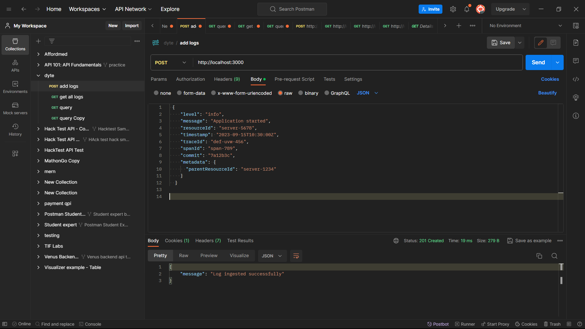
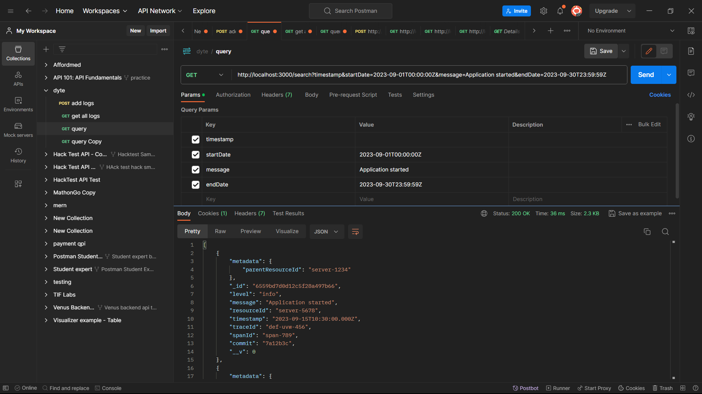

<!-- TABLE OF CONTENTS -->
<details>
  <summary>Table of Contents</summary>
  <ol>
    <li>
      <a href="#about-the-project">About The Project</a>
      <ul>
        <li><a href="#built-with">Built With</a></li>
      </ul>
    </li>
    <li>
      <a href="#getting-started">Getting Started</a>
      <ul>
        <li><a href="#prerequisites">Prerequisites</a></li>
        <li><a href="#installation">Installation</a></li>
      </ul>
    </li>
    <li><a href="#usage">Usage</a></li>
    <li><a href="#roadmap">Roadmap</a></li>
    <li><a href="#contributing">Contributing</a></li>
    <li><a href="#license">License</a></li>
    <li><a href="#contact">Contact</a></li>
    <li><a href="#acknowledgments">Acknowledgments</a></li>
  </ol>
</details>

## Add Logs



## Query Logs




<!-- GETTING STARTED -->

### Prerequisites

This is an example of how to list things you need to use the software and how to install them.
* npm
  ```sh
  npm install npm@latest -g
  ```
* redis (Redis-x64-3.0.504.msi) default port = 6379
  ```js
  https://github.com/microsoftarchive/redis/releases
  ```

### Installation


1. Clone the repo
   ```sh
   git clone https://github.com/dyte-submissions/november-2023-hiring-abhishekchauhan15.git
   ```
2. Install NPM packages
   ```sh
   npm install
   ```
3. Make the .env file
   ```sh
   touch .env
   ```
4. Setup the environment variables 
    ```js
    MONGO_URI="Your mondodb atlas url"
    PORT=3000
    ```
5. Start the server 
    ```js
    node app.py
    ```

<p align="right">(<a href="#readme-top">back to top</a>)</p>


<!-- ROADMAP -->
#Features 
## Log Ingestor

- [X] Mechanism to ingest logs
- [X] Scalability to handle high volumes of logs efficiently (Used Node **Clusters**, **batching**, **queue** via **redis**)
- [X] Logs are ingested via an HTTP server on port 3000 

## Query Interface
- [X] full-text search across logs 
- [X] Include filters based on:
    - [x] Level
    - [x] message
    - [x] resourceId
    - [x] timestamp
    - [x] traceId
    - [x] spanId
    - [x] commit
    - [x] metadata.parentResourceId
- [x] Efficient and quick search results (**Indexing**)

- [X] Logs are ingested via an HTTP server on port 3000 

## Advanced Features
- [X] Implement search within specific date ranges 
- [X] Utilize **regular expressions** for search.
- [X] Allow combining multiple filters

<p align="right">(<a href="#readme-top">back to top</a>)</p>

#### API endpoints

**Main URL**: [http://localhost:3000](http://localhost:5000)


- **Logs**

  - Get all jogs: [http://localhost:3000/getlogs](http://localhost:3000/getlogs) [GET]
  - Add Log: [http://localhost:3000](http://localhost:3000) [POST]
  - Query Log: [http://localhost:3000/search?timestamp&startDate=2023-09-01T00:00:00Z&endDate=2023-09-30T23:59:59Z](http://localhost:3000/search?timestamp&startDate=2023-09-01T00:00:00Z&endDate=2023-09-30T23:59:59Z) [GET]
